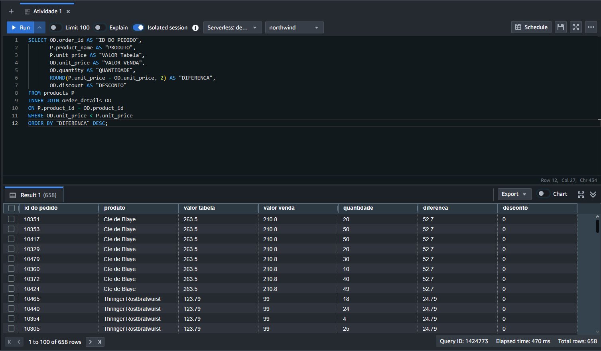
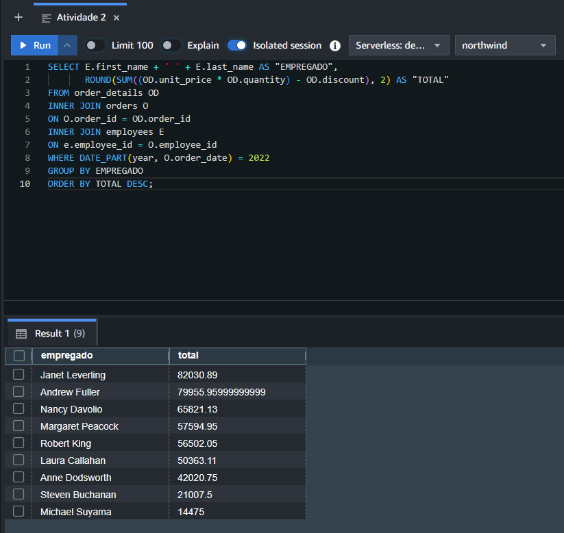
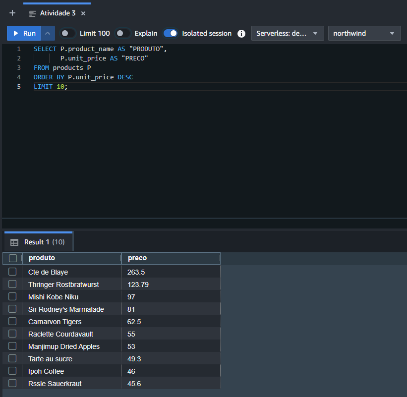
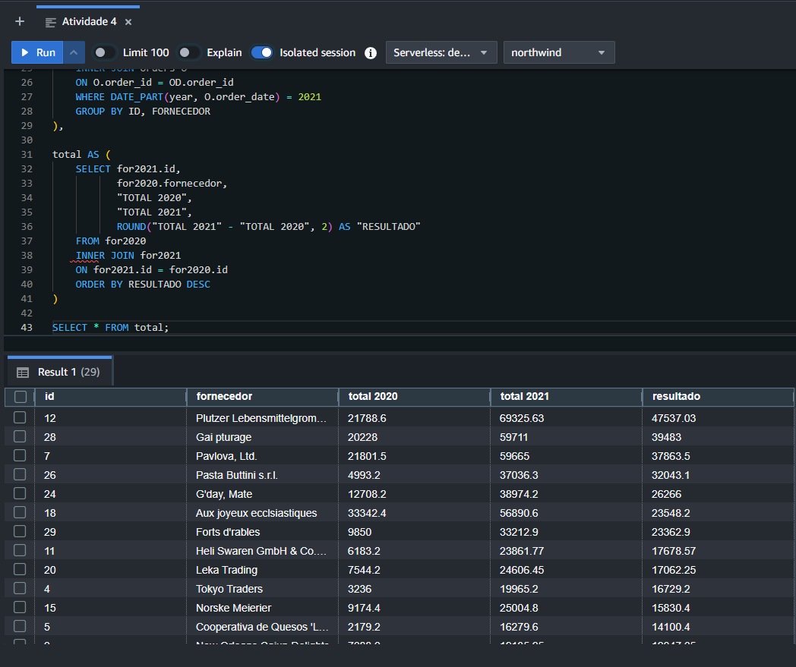
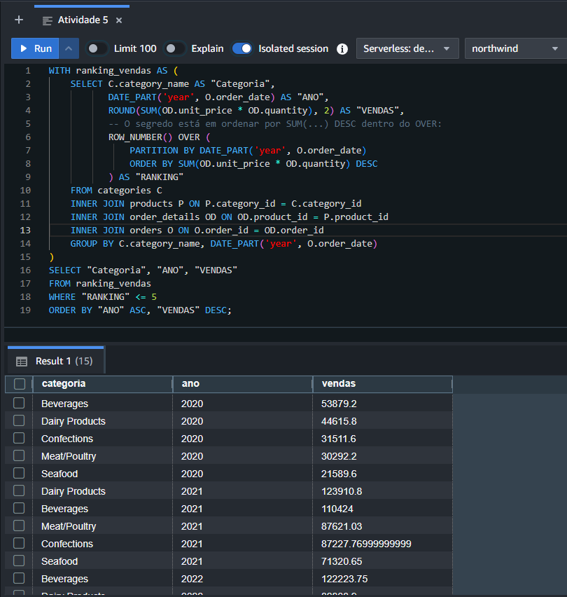

# Northwind Data Analytics on AWS Redshift 🚀

Este repositório contém a resolução de uma série de desafios de negócio utilizando o banco de dados de teste **Northwind**, totalmente implementado e executado na nuvem utilizando o **AWS Redshift**.

O objetivo deste projeto foi simular cenários reais de um Engenheiro / Analista de Dados, desde a estruturação do ambiente em nuvem, carga massiva de dados (Bulk Load via S3) até a criação de consultas SQL complexas para responder a dores de negócio.

---

## 🛠️ Tecnologias e Ferramentas

* **Banco de Dados / Data Warehouse:** AWS Redshift
* **Storage / Data Lake:** AWS S3 (Armazenamento dos arquivos `.csv` de origem)
* **Linguagem:** SQL (Dialeto PostgreSQL/Redshift)

---

## 🏗️ Arquitetura e Infraestrutura do Projeto

O fluxo de dados seguiu as etapas abaixo:
1. **Modelagem:** Criação do banco de dados `northwind` e sua estrutura DDL.
2. **Ingestão (Datalake -> DW):** Upload dos dados históricos em formato CSV para um bucket no **AWS S3**.
3. **Carga (Copy Command):** Execução de comandos `COPY` utilizando credenciais IAM para realizar o carregamento massivo de alto desempenho diretamente para os nós do Redshift.

---

## 📊 Desafios de Negócio Resolvidos

Abaixo estão as perguntas de negócio propostas e a abordagem SQL utilizada para resolvê-las:

### 🔹 Desafio 1: Análise de Preço de Tabela vs. Preço Praticado
* **Problema:** Identificar se a empresa tem feito muitas vendas com descontos agressivos ou preços abaixo do esperado.
* **Métricas analisadas:** Diferença entre o preço de tabela do produto e o preço real de venda, quantidade vendida, ordenado pelas maiores distorções.
* **Onde encontrar o código:** [`scripts/atividade_1.sql`](scripts/atividade_1.sql)

### 🔹 Desafio 2: Avaliação de Performance de Vendas (Robert vs. Equipe)
* **Problema:** Um dos vendedores (Robert) demonstrou preocupação com sua performance. A diretoria precisava entender o desempenho dele frente aos demais colegas no último ano.
* **Técnicas SQL:** Funções de agregação, filtros temporais e ordenação de performance de faturamento por funcionário.
* **Onde encontrar o código:** [`scripts/atividade_2.sql`](scripts/atividade_2.sql)

### 🔹 Desafio 3: Top 10 Produtos Mais Caros
* **Problema:** Mapeamento estratégico de portfólio para identificar os 10 produtos de maior valor unitário.
* **Onde encontrar o código:** [`scripts/atividade_3.sql`](scripts/atividade_3.sql)

### 🔹 Desafio 4: Evolução de Vendas por Fornecedor (Últimos 2 Anos)
* **Problema:** Consolidar e comparar o faturamento gerado por fornecedor nos últimos dois anos para identificar parceiros comerciais em crescimento.
* **Onde encontrar o código:** [`scripts/atividade_4.sql`](scripts/atividade_4.sql)

### 🔹 Desafio 5: Top 5 Categorias Mais Vendidas por Ano (Preparação para Dashboard)
* **Problema:** Agrupar o volume de vendas por categoria de produto e por ano, limitando estritamente às 5 maiores de cada período para alimentar um dashboard gerencial.
* **Técnicas SQL:** Utilização de Window Functions (`ROW_NUMBER()` ou `DENSE_RANK()`) combinadas com `PARTITION BY`.
* **Onde encontrar o código:** [`scripts/atividade_5.sql`](scripts/atividade_5.sql)

---

## 📸 Evidências e Resultados

*Resultado das consultas sendo executadas no Query Editor do Redshift.*

| Cenário | Visualização do Resultado |
| :--- | :--- |
| **Resultado da Atividade 1** |  |
| **Resultado da Atividade 2** |  |
| **Resultado da Atividade 3** |  |
| **Resultado da Atividade 4** |  |
| **Resultado da Atividade 5** |  |

---

## ⚙️ Como Executar este Projeto

1. Certifique-se de ter um cluster **AWS Redshift** ativo.
2. Execute o script contido em [`database/northwindddl.sql`](database/northwindddl.sql) para criar a estrutura das tabelas.
3. Faça o upload dos arquivos [`.csv`](csv/) da base Northwind em um Bucket do **AWS S3**.
4. Configure suas credenciais IAM no arquivo [`database/copy.sql`](database/copy.sql) e execute-o para carregar os dados.
5. Sinta-se livre para rodar os scripts da pasta [`scripts/`](scripts/) para validar os resultados!

---
*Projeto desenvolvido como parte de estudos práticos de Engenharia de Dados.*
